# VMenu a Full-Featured Altv Menu UI made with Javascript by Florian L&auml;mmlein
#### Creates an interactive webview based Menu.
#### The VMenu System has over 51+ Items in the acctual stable version witch you can use.
&nbsp;
&nbsp;
***
## VMenu Features
- Easy to use, super fast and smoth.
- Heritage Slider.
- Multiple Menus.
- Statics Panel.
- Color Picker.
- Color Panel.
- Input Field.
- Grid Panel.
- Check Box.
- Switch.
- And Much more!
&nbsp;
&nbsp;
***
&nbsp;
&nbsp;
***
## How to install
1. #### Copy the following line.
    git clone https://github.com/Flory-1/altv-VMenu.git
2. #### Paste the files into the altv resources.
&nbsp;
***
## All <a id="Items">Items</a> in the VMenu System
| <strong style="color: #6ba0ff;">Item</strong> | <strong style="color: #6ba0ff;">Attribute</strong> | <strong style="color: #6ba0ff;">Description</strong> | <strong style="color: #6ba0ff;">Type</strong> | <strong style="color: #6ba0ff;">Default value</strong> |
| --- | --- | --- | --- | --- |
| `PlayerUI` | | | | |
| | title | Menu title | String | None |
| | desc | Menu description | String | None |
| | font | Menu font style (Fantasy, Menus, ChaletLondon) | String | Fantasy |
| | float | Menu Display Position (left, right) | String | left |
| | x | Menu X from top left corner | Int | 50 |
| | y | Menu y from left corner | Int | 50 |
| | width | Menu width (min: 300, max: 400) | Int | 340 |
| | color | Menu custom color (hex, altv) | String | None |
| | max_items | Menu maximum items (max: 18, min: 1) | Int | 12 |
| `PSubMenu` | title | Menu title | String | None |
| | desc | Menu description | String | None |
| | viewTitle | Main Menu title | String | None |
| | viewDesc | Main Menu description | String | None |
| | onSide | Open SubMenu on side (true, false) | Bool | false |
| `PItem` | title | Item title | String | None |
| | desc | Item description not displayed | String | None |
| | value | Item value not displayed | Any | None |
| | icon | Item icon from [Fontawesome](https://fontawesome.com/v5.15/icons?d=gallery&p=2&m=free) | String | None |
| | tag | Item tag for Eventhandling not displayed | String | None |
| | badge | Item Badge from `Badge` | Badge | None |
| | ...kwargs | Item Eventhandlers | String | None |
| `PSeperator` | title | Item title | String | None |
| | badge | Item Badge from `Badge` | Badge | None |
| `PItemList` | title | Item title | String | None |
| | desc | Item description not displayed | String | None |
| | value | Item value not displayed | Any | None |
| | icon | Item icon from [Fontawesome](https://fontawesome.com/v5.15/icons?d=gallery&p=2&m=free) | String | None |
| | tag | Item tag for Eventhandling not displayed | String | None |
| | items | Item value list | Array | [[], []] |
| | imageItem | Item control for `PImageItem` | PImageItem | None |
| | ...kwargs | Item Eventhandlers | String | None |
| `PNumberList` | title | Item title | String | None |
| | desc | Item description not displayed | String | None |
| | value | Item value not displayed | Int | None |
| | icon | Item icon from [Fontawesome](https://fontawesome.com/v5.15/icons?d=gallery&p=2&m=free) | String | None |
| | tag | Item tag for Eventhandling not displayed | String | None |
| | max | Item maximum Numbers | Int | 1 |
| | ...kwargs | Item Eventhandlers | String | None |
| `PCheckBox` | title | Item title | String | None |
| | desc | Item description not displayed | String | None |
| | value | Item value not displayed | Bool | false |
| | icon | Item icon from [Fontawesome](https://fontawesome.com/v5.15/icons?d=gallery&p=2&m=free) | String | None |
| | tag | Item tag for Eventhandling not displayed | String | None |
| | ...kwargs | Item Eventhandlers | String | None |
| `PSwitch` | title | Item title | String | None |
| | desc | Item description not displayed | String | None |
| | value | Item value not displayed | Bool | false |
| | icon | Item icon from [Fontawesome](https://fontawesome.com/v5.15/icons?d=gallery&p=2&m=free) | String | None |
| | tag | Item tag for Eventhandling not displayed | String | None |
| | ...kwargs | Item Eventhandlers | String | None |
| `PSlider` | title | Item title | String | None |
| | desc | Item description not displayed | String | None |
| | value | Item value not displayed | Int | None |
| | icon | Item icon from [Fontawesome](https://fontawesome.com/v5.15/icons?d=gallery&p=2&m=free) | String | None |
| | tag | Item tag for Eventhandling not displayed | String | None |
| | max | Item maximum Slider range | Int | 1 |
| | ...kwargs | Item Eventhandlers | String | None |
| `PHeritageSlider` | title | Item title | String | None |
| | desc | Item description not displayed | String | None |
| | value | Item value not displayed | Int | None |
| | icon | Item icon from [Fontawesome](https://fontawesome.com/v5.15/icons?d=gallery&p=2&m=free) | String | None |
| | tag | Item tag for Eventhandling not displayed | String | None |
| | ...kwargs | Item Eventhandlers | String | None |
| `PPercentageBar` | title | Item title | String | None |
| | desc | Item description not displayed | String | None |
| | value | Item value not displayed | Int | None |
| | icon | Item icon from [Fontawesome](https://fontawesome.com/v5.15/icons?d=gallery&p=2&m=free) | String | None |
| | tag | Item tag for Eventhandling not displayed | String | None |
| | max | Item maximum PercentageBar range | Int | 1 |
| | ...kwargs | Item Eventhandlers | String | None |
| `PImageItem` | src | Item src image to path | String | None |
| `PImageView` | title | Item title | String | None |
| | desc | Item description not displayed | String | None |
| | value | Item value not displayed | Int | None |
| | icon | Item icon from [Fontawesome](https://fontawesome.com/v5.15/icons?d=gallery&p=2&m=free) | String | None |
| | tag | Item tag for Eventhandling not displayed | String | None |
| | src | Item src image to path | String | None |
| | viewTitle | Main Menu title | String | None |
| | viewDesc | Main Menu description | String | None |
| | viewFooter | Main Menu footer title | String | None |
| | badge | Item Badge from `Badge` | Badge | None |
| | ...kwargs | Item Eventhandlers | String | None |
| `PInput` | title | Item title | String | None |
| | desc | Item description not displayed | String | None |
| | value | Item value not displayed | String | None |
| | icon | Item icon from [Fontawesome](https://fontawesome.com/v5.15/icons?d=gallery&p=2&m=free) | String | None |
| | tag | Item tag for Eventhandling not displayed | String | None |
| | max | Item maximum input | Int | 100 |
| | pattern | Item input pattern | String | None |
| | ...kwargs | Item Eventhandlers | String | None |
| `PColorPicker` | title | Item title | String | None |
| | desc | Item description not displayed | String | None |
| | value | Item value from `Color` | Color | None |
| | icon | Item icon from [Fontawesome](https://fontawesome.com/v5.15/icons?d=gallery&p=2&m=free) | String | None |
| | tag | Item tag for Eventhandling not displayed | String | None |
| | viewTitle | Main Menu title | String | None |
| | viewDesc | Main Menu description | String | None |
| | ...kwargs | Item Eventhandlers | String | None |
| `PStaticsPanel` | title | Item title | Array, String | [None] |
| | value | Item value | Array, String | [None] |
| | icon | Item icon from [Fontawesome](https://fontawesome.com/v5.15/icons?d=gallery&p=2&m=free) | Array,String | [None] |
| | tag | Item tag for Eventhandling not displayed | Array, String | [None] |
| | max | Item maximum Static range | Array, Int | [100] |
| `PColorPanel` | title | Item title | String | None |
| | value | Item value (hex) | string | None |
| | colors | Item colors list (hex) | Array, String | [None] |
| | tag | Item tag for Eventhandling not displayed | String | None |
| `PGridPanel` | title | Item title | String | None |
| | value | Item value (min: 0, max: 24) | Int | None |
| | icon | Item icon from [Fontawesome](https://fontawesome.com/v5.15/icons?d=gallery&p=2&m=free) | String | None |
| | tag | Item tag for Eventhandling not displayed | String | None |
| | | | | |
| `SettingsUI` | | | | |
| | title | Menu title | String | None |
| | font | Menu font style (Fantasy, Menus, ChaletLondon) | String | Fantasy |
| | color | Menu custom color (hex, altv) | String | None |
| | max_items | Menu maximum items (max: 12, min: 1) | Int | 6 |
| | max_tabs | Menu maximum tabs (max: 12, min: 1) | Int | 6 |
| `STab` | title | Item title | String | None |
| | icon | Item icon from [Fontawesome](https://fontawesome.com/v5.15/icons?d=gallery&p=2&m=free) | String | None |
| `STabData` | title | Item title | String | None |
| | icon | Item icon from [Fontawesome](https://fontawesome.com/v5.15/icons?d=gallery&p=2&m=free) | String | None |
| `SItem` | title | Item title | String | None |
| | desc | Item description not displayed | String | None |
| | value | Item value not displayed | Any | None |
| | icon | Item icon from [Fontawesome](https://fontawesome.com/v5.15/icons?d=gallery&p=2&m=free) | String | None |
| | tag | Item tag for Eventhandling not displayed | String | None |
| | badge | Item Badge from `Badge` | Badge | None |
| | ...kwargs | Item Eventhandlers | String | None |
| `SSeperator` | title | Item title | String | None |
| | badge | Item Badge from `Badge` | Badge | None |
| `SItemList` | title | Item title | String | None |
| | desc | Item description not displayed | String | None |
| | value | Item value not displayed | Any | None |
| | icon | Item icon from [Fontawesome](https://fontawesome.com/v5.15/icons?d=gallery&p=2&m=free) | String | None |
| | tag | Item tag for Eventhandling not displayed | String | None |
| | items | Item value list | Array | [[], []] |
| | imageItem | Item control for `SImageItem` | PImageItem | None |
| | ...kwargs | Item Eventhandlers | String | None |
| `SNumberList` | title | Item title | String | None |
| | desc | Item description not displayed | String | None |
| | value | Item value not displayed | Int | None |
| | icon | Item icon from [Fontawesome](https://fontawesome.com/v5.15/icons?d=gallery&p=2&m=free) | String | None |
| | tag | Item tag for Eventhandling not displayed | String | None |
| | max | Item maximum Numbers | Int | 1 |
| | ...kwargs | Item Eventhandlers | String | None |
| `SCheckBox` | title | Item title | String | None |
| | desc | Item description not displayed | String | None |
| | value | Item value not displayed | Bool | false |
| | icon | Item icon from [Fontawesome](https://fontawesome.com/v5.15/icons?d=gallery&p=2&m=free) | String | None |
| | tag | Item tag for Eventhandling not displayed | String | None |
| | ...kwargs | Item Eventhandlers | String | None |
| `SSwitch` | title | Item title | String | None |
| | desc | Item description not displayed | String | None |
| | value | Item value not displayed | Bool | false |
| | icon | Item icon from [Fontawesome](https://fontawesome.com/v5.15/icons?d=gallery&p=2&m=free) | String | None |
| | tag | Item tag for Eventhandling not displayed | String | None |
| | ...kwargs | Item Eventhandlers | String | None |
| `SSlider` | title | Item title | String | None |
| | desc | Item description not displayed | String | None |
| | value | Item value not displayed | Int | None |
| | icon | Item icon from [Fontawesome](https://fontawesome.com/v5.15/icons?d=gallery&p=2&m=free) | String | None |
| | tag | Item tag for Eventhandling not displayed | String | None |
| | max | Item maximum Slider range | Int | 1 |
| | ...kwargs | Item Eventhandlers | String | None |
| `SPercentageBar` | title | Item title | String | None |
| | desc | Item description not displayed | String | None |
| | value | Item value not displayed | Int | None |
| | icon | Item icon from [Fontawesome](https://fontawesome.com/v5.15/icons?d=gallery&p=2&m=free) | String | None |
| | tag | Item tag for Eventhandling not displayed | String | None |
| | max | Item maximum PercentageBar range | Int | 1 |
| | ...kwargs | Item Eventhandlers | String | None |
| `SImageItem` | src | Item src image to path | String | None |
| | | | | |
| `GameUI` | | | | |
| | title | Menu title | String | None |
| | desc | Menu description | String | None |
| | font | Menu font style (Fantasy, Menus, ChaletLondon) | String | Fantasy |
| | color | Menu custom color (hex, altv) | String | None |
| `GSettings` | max_items | Menu maximum items (max: 10, min: 1) | Int | 5 |
| `GPlayers` | min_items | Menu minimum items (min: 1) | Int | 1 |
| | max_items | Menu maximum items (max: 20) | Int | 10 |
| `GDetails` | img | Menu image src to path | String | None |
| | max_items | Menu maximum items (max: 6, min: 1) | Int | 3 |
| `GItem` | title | Item title | String | None |
| | desc | Item description not displayed | String | None |
| | value | Item value not displayed | Any | None |
| | icon | Item icon from [Fontawesome](https://fontawesome.com/v5.15/icons?d=gallery&p=2&m=free) | String | None |
| | tag | Item tag for Eventhandling not displayed | String | None |
| | badge | Item Badge from `Badge` | Badge | None |
| | ...kwargs | Item Eventhandlers | String | None |
| `GSeperator` | title | Item title | String | None |
| | badge | Item Badge from `Badge` | Badge | None |
| `GItemList` | title | Item title | String | None |
| | desc | Item description not displayed | String | None |
| | value | Item value not displayed | Any | None |
| | icon | Item icon from [Fontawesome](https://fontawesome.com/v5.15/icons?d=gallery&p=2&m=free) | String | None |
| | tag | Item tag for Eventhandling not displayed | String | None |
| | items | Item value list | Array | [[], []] |
| | imageItem | Item control for `SImageItem` | PImageItem | None |
| | ...kwargs | Item Eventhandlers | String | None |
| `GNumberList` | title | Item title | String | None |
| | desc | Item description not displayed | String | None |
| | value | Item value not displayed | Int | None |
| | icon | Item icon from [Fontawesome](https://fontawesome.com/v5.15/icons?d=gallery&p=2&m=free) | String | None |
| | tag | Item tag for Eventhandling not displayed | String | None |
| | max | Item maximum Numbers | Int | 1 |
| | ...kwargs | Item Eventhandlers | String | None |
| `GCheckBox` | title | Item title | String | None |
| | desc | Item description not displayed | String | None |
| | value | Item value not displayed | Bool | false |
| | icon | Item icon from [Fontawesome](https://fontawesome.com/v5.15/icons?d=gallery&p=2&m=free) | String | None |
| | tag | Item tag for Eventhandling not displayed | String | None |
| | ...kwargs | Item Eventhandlers | String | None |
| `GSwitch` | title | Item title | String | None |
| | desc | Item description not displayed | String | None |
| | value | Item value not displayed | Bool | false |
| | icon | Item icon from [Fontawesome](https://fontawesome.com/v5.15/icons?d=gallery&p=2&m=free) | String | None |
| | tag | Item tag for Eventhandling not displayed | String | None |
| | ...kwargs | Item Eventhandlers | String | None |
| `GSlider` | title | Item title | String | None |
| | desc | Item description not displayed | String | None |
| | value | Item value not displayed | Int | None |
| | icon | Item icon from [Fontawesome](https://fontawesome.com/v5.15/icons?d=gallery&p=2&m=free) | String | None |
| | tag | Item tag for Eventhandling not displayed | String | None |
| | max | Item maximum Slider range | Int | 1 |
| | ...kwargs | Item Eventhandlers | String | None |
| `GPercentageBar` | title | Item title | String | None |
| | desc | Item description not displayed | String | None |
| | value | Item value not displayed | Int | None |
| | icon | Item icon from [Fontawesome](https://fontawesome.com/v5.15/icons?d=gallery&p=2&m=free) | String | None |
| | tag | Item tag for Eventhandling not displayed | String | None |
| | max | Item maximum PercentageBar range | Int | 1 |
| | ...kwargs | Item Eventhandlers | String | None |
| `GPlayer` | title | Item title | String | None |
| | status | Player Status ([`STATUS_HOST`](#Constats), [`STATUS_ENTER`](#Constats), [`STATUS_LEAVE`](#Constats), [`STATUS_READY`](#Constats)) | String | [`STATUS_HOST`](#Constats) |
| | badge | Item Badge from `Badge` | Badge | None |
| `GDetail` | title | Item title | String | None |
| | value | Item value | Any | None |
| | icon | Item icon from [Fontawesome](https://fontawesome.com/v5.15/icons?d=gallery&p=2&m=free) | String | None |
| | badge | Item Badge from `Badge` | Badge | None |
| | | | | |
| `Others` | | | | |
| `Badge` | title | Item title | String | None |
| | icon | Item icon from [Fontawesome](https://fontawesome.com/v5.15/icons?d=gallery&p=2&m=free) | String | None |
| `InstrutionalBar` | x | Bar X from top left corner | Int | 20 |
| | y | Bar y from left corner | Int | 20 |
| `IButton` | title | Item title | String | None |
| | icon | Item icon from [Fontawesome](https://fontawesome.com/v5.15/icons?d=gallery&p=2&m=free) | String | None |
| `IText` | title | Item title | String | None |
| | icon | Item icon from [Fontawesome](https://fontawesome.com/v5.15/icons?d=gallery&p=2&m=free) | String | None |
| `MessageSmall` | title | Message title | String | None |
| | desc | Message description not displayed | String | None |
| | color | Message custom color (hex, altv) | String | None |
| | timer | Message timer to dissaper (ms) | Int | 2000 |
| `MessageMidi` | title | Message title | String | None |
| | desc | Message description not displayed | String | None |
| | color | Message custom color (hex, altv) | String | None |
| | timer | Message timer to dissaper (ms) | Int | 2000 |
| `MessageBig` | title | Message title | String | None |
| | desc | Message description not displayed | String | None |
| | color | Message custom color (hex, altv) | String | None |
| | timer | Message timer to dissaper (ms) | Int | 2000 |
| `Color` | r | Color code (Red, hex) | String, Int | None |
| | g | Color code (Green) | Int | 0 |
| | b | Color code (Blue) | Int | 0 |

&nbsp;
&nbsp;
## All Events in the VMenu System
| <strong style="color: #6ba0ff;">Event</strong> | <strong style="color: #6ba0ff;">Function</strong> | <strong style="color: #6ba0ff;">Description</strong> | <strong style="color: #6ba0ff;">Return Type</strong> | <strong style="color: #6ba0ff;">Return value</strong> |
| --- | --- | --- | --- | --- |
| [`PlayerUI`](#Items) | | | | |
| `IndexChange` | on | Change Eventhandler | Int | Index of Item |
| `ItemSelect` | on | Enter Eventhandler | Object | Item Values |
| `MenuOpen` | on | Open Eventhandler | Bool | Open Status |
| `MenuClose` | on | Close Eventhandler | Bool | Close Status |
| | | | | |
| [`PSubMenu`](#Items) | | | | |
| `IndexChange` | on | Change Eventhandler | Int | Index of Item |
| `ItemSelect` | on | Enter Eventhandler | Object | Item Values |
| `MenuOpen` | on | Open Eventhandler | Bool | Open Status |
| `MenuClose` | on | Close Eventhandler | Bool | Close Status |
| | | | | |
| [`SettingsUI`](#Items) | | | | |
| `IndexChange` | on | Change Eventhandler | Int | Index of Item |
| `ItemSelect` | on | Enter Eventhandler | Object | Item Values |
| `MenuOpen` | on | Open Eventhandler | Bool | Open Status |
| `MenuClose` | on | Close Eventhandler | Bool | Close Status |
| | | | | |
| [`GameUI`](#Items) | | | | |
| `IndexChange` | on | Change Eventhandler | Int | Index of Item |
| `ItemSelect` | on | Enter Eventhandler | Object | Item Values |
| `MenuOpen` | on | Open Eventhandler | Bool | Open Status |
| `MenuClose` | on | Close Eventhandler | Bool | Close Status |

&nbsp;
&nbsp;
## All Return Types of the <a id="Events">Events</a> in the VMenu System
| <strong style="color: #6ba0ff;">Event</strong> | <strong style="color: #6ba0ff;">Return Item</strong> | <strong style="color: #6ba0ff;">Description</strong> | <strong style="color: #6ba0ff;">Type</strong> |
| --- | --- | --- | --- |
| [`IndexChange`](#Events) | | | |
| | index | Current Item Index Number from Menu | Int |
| [`ItemSelect`](#Events) | | | |
| | value | Current Item value if [`ONLY_VALUE`](#Constats) | Any |
| | text | Current Item title if [`ONLY_TEXT`](#Constats), description if [`DESC_CHECK`](#Constats) not set | String |
| | tag | Current Item tag if [`ONLY_TAG`](#Constats) | Any |
| | panel_value | Current Item Panel value if [`ONLY_VALUE`](#Constats) & Panel is set | Any |
| | panel_text | Current Item Panel title if [`ONLY_TEXT`](#Constats), description if [`DESC_CHECK`](#Constats) not set & Panel is set | String |
| | panel_tag | Current Item Panel tag if [`ONLY_TAG`](#Constats) & Panel is set | Any |
| [`MenuOpen`](#Events) | | | |
| | status | Menu open status | Bool |
| [`MenuClose`](#Events) | | | |
| | status | Menu close status | Bool |

&nbsp;
&nbsp;
## All <a id="Constats">Constats</a> in the VMenu System set into `...kwargs`
| <strong style="color: #6ba0ff;">Constant</strong> | <strong style="color: #6ba0ff;">Description</strong> |
| --- | --- |
| `DESC_CHECK` | On [`ItemSelect`](#Events) return Item description |
| `DISABLED` | Set Item status disabled |
| `AUTO_SELECT` | On [`IndexChange`](#Events) trigger [`ItemSelect`](#Events) |
| `ONLY_VALUE` | On [`ItemSelect`](#Events) return only Item value |
| `ONLY_TEXT` | On [`ItemSelect`](#Events) return only Item title, description if [`DESC_CHECK`](#Constats) not set |
| `ONLY_TAG` | On [`ItemSelect`](#Events) return only Item tag |
| `READ_ONLY` | Item value is not editable by [`ArrowLeft`](#Controls) or [`ArrowRight`](#Controls) |
| | |
| `STATUS_HOST` | [`GameUI`](#Items) Item [`GPlayer`](#Items) attribute `status` value |
| `STATUS_ENTER` | [`GameUI`](#Items) Item [`GPlayer`](#Items) attribute `status` value |
| `STATUS_LEAVE` | [`GameUI`](#Items) Item [`GPlayer`](#Items) attribute `status` value |
| `STATUS_READY` | [`GameUI`](#Items) Item [`GPlayer`](#Items) attribute `status` value |

&nbsp;
&nbsp;
## All <a id="Controls">Controls</a> in the VMenu System
| <strong style="color: #6ba0ff;">Menu</strong> | <strong style="color: #6ba0ff;">Control</strong> | <strong style="color: #6ba0ff;">Description</strong> |
| --- | --- | --- |
| [`PlayerUI`](#Items) | | |
| | `ArrowUp` | Go an Item entry up trigger [`IndexChange`](#Events) |
| | `ArrowDown` | Go an Item entry down trigger [`IndexChange`](#Events) |
| | `ArrowLeft` | Change an Item value |
| | `ArrowRight` | Change an Item value |
| | `Numpad 8` | Change an Item Panel value (Up) |
| | `Numpad 5` | Change an Item Panel value (Down) |
| | `Numpad 4` | Change an Item Panel value (Left) |
| | `Numpad 6` | Change an Item Panel value (Right) |
| | `Enter` | Select an Item value trigger [`ItemSelect`](#Events) |
| | `m` | Open Menu trigger [`MenuOpen`](#Events) if is open trigger [`MenuClose`](#Events) |
| | | |
| [`PSubMenu`](#Items) | | |
| | `Backspace` | Close Menu if is open |
| | `ArrowUp` | Go an Item entry up trigger [`IndexChange`](#Events) |
| | `ArrowDown` | Go an Item entry down trigger [`IndexChange`](#Events) |
| | `ArrowLeft` | Change an Item value |
| | `ArrowRight` | Change an Item value |
| | `Numpad 8` | Change an Item Panel value (Up) |
| | `Numpad 5` | Change an Item Panel value (Down) |
| | `Numpad 4` | Change an Item Panel value (Left) |
| | `Numpad 6` | Change an Item Panel value (Right) |
| | `Enter` | Select an Item value trigger [`ItemSelect`](#Events) |
| | | |
| [`SettingsUI`](#Items) | | |
| | `Backspace` | Close [`STabData`](#Items) if is open |
| | `ArrowUp` | Go an Item entry up trigger [`IndexChange`](#Events) |
| | `ArrowDown` | Go an Item entry down trigger [`IndexChange`](#Events) |
| | `ArrowLeft` | Change an Item value |
| | `ArrowRight` | Change an Item value |
| | `Enter` | Select an Item value trigger [`ItemSelect`](#Events) |
| | `Escape` | Open Menu trigger [`MenuOpen`](#Events) if is open trigger [`MenuClose`](#Events) |
| | | |
| [`GameUI`](#Items) | | |
| | `ArrowUp` | Go an Item entry up trigger [`IndexChange`](#Events) |
| | `ArrowDown` | Go an Item entry down trigger [`IndexChange`](#Events) |
| | `ArrowLeft` | Change an Item value |
| | `ArrowRight` | Change an Item value |
| | `Enter` | Select an Item value trigger [`ItemSelect`](#Events) |

&nbsp;
&nbsp;
## How to use PlayerUI
### Example 1
```js
// 1: Import the VMenu.
import * as VMenu from './js/VMenu.js';

// 2. Setup an VMenu.
const MainMenu = new VMenu.PlayerUI("VMenu", "Menu Example", "", "right", 50, 50, 340, "{#fa8f32}");

MainMenu.addItem(new VMenu.PSeperator("Vehicles"));
MainMenu.addItem(new VMenu.PSlider("Slider", "~b~Slider ~w~example ~r~with ~g~color~y~", 0, "", "", 20, VMenu.DISABLED));
MainMenu.addItem(new VMenu.PSeperator("Seperator"));
MainMenu.addItem(new VMenu.PNumberList("NumberList", "NumberList example", 0, "", "", 9));

// 3. Start the VMenu.
MainMenu.start();

// 4. Listen to the VMenu.
MainMenu.ItemSelect.on((e) => {
    console.log(e);
});
```
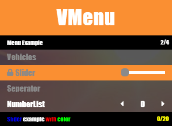
### Example 2
```js
// 1: Import the VMenu.
import * as VMenu from './js/VMenu.js';

// 2. Setup an VMenu.
const MainMenu = new VMenu.PlayerUI("VMenu", "Menu Example", "", "right", 50, 50, 340, "{#fa8f32}");

MainMenu.addItem(new VMenu.PSeperator("Vehicles"));
MainMenu.addItem(new VMenu.PSlider("Slider", "~b~Slider ~w~example ~r~with ~g~color~y~", 0, "", "", 20, VMenu.DISABLED));
MainMenu.addItem(new VMenu.PSeperator("Seperator"));
MainMenu.addItem(new VMenu.PPercentageBar("PercentageBar", "Percent example", 0, "", "", 100));
MainMenu.addItem(new VMenu.PNumberList("NumberList", "NumberList example", 0, "", "", 9));
MainMenu.addItem(new VMenu.PImageView("Adder", "Spawn Vehicle Adder", "", "", "", "./assets/adder.png"));
MainMenu.addItem(new VMenu.PCheckBox("Checkbox", "{#ff0000}Checkbox{#ffffff} example", false));
MainMenu.addItem(new VMenu.PSwitch("Switch", "Switch example"));

// 3. Start the VMenu.
MainMenu.start();

// 4. Listen to the VMenu.
MainMenu.ItemSelect.on((e) => {
    console.log(e);
});
```
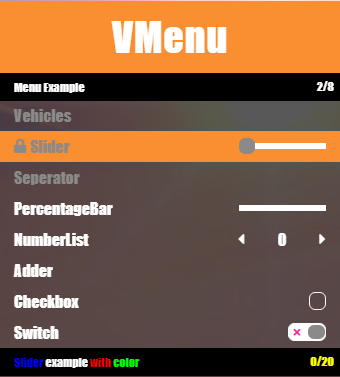
### Example 3
```js
// 1: Import the VMenu.
import * as VMenu from './js/VMenu.js';

// 2. Setup an VMenu.
const MainMenu = new VMenu.PlayerUI("VMenu", "Menu Example", "", "right", 50, 50, 340, "{#fa8f32}");

MainMenu.addItem(new VMenu.PSeperator("Vehicles"));
MainMenu.addItem(new VMenu.PSlider("Slider", "~b~Slider ~w~example ~r~with ~g~color~y~", 0, "", "", 20, VMenu.DISABLED));
MainMenu.addItem(new VMenu.PSeperator("Seperator"));
MainMenu.addItem(new VMenu.PPercentageBar("PercentageBar", "Percent example", 0, "", "", 100));
MainMenu.addItem(new VMenu.PNumberList("NumberList", "NumberList example", 0, "", "", 9));
MainMenu.addItem(new VMenu.PInput("Input", "Input example", ""));
MainMenu.addItem(new VMenu.PInput("Input 1", "Input example with max", "Hi", "", "", 10));
MainMenu.addItem(new VMenu.PImageView("Adder", "Spawn Vehicle Adder", "", "", "", "./assets/adder.png"));
MainMenu.addItem(new VMenu.PCheckBox("Checkbox", "{#ff0000}Checkbox{#ffffff} example", false));
MainMenu.addItem(new VMenu.PSwitch("Switch", "Switch example"));
MainMenu.addItem(new VMenu.PHeritageSlider("Heritage Slider", "Heritage Slider example", 0, "", ""));

// 3. Start the VMenu.
MainMenu.start();

// 4. Listen to the VMenu.
MainMenu.IndexChange.on((e) => {
    console.log(e);
});
MainMenu.ItemSelect.on((e) => {
    console.log(e);
});
```
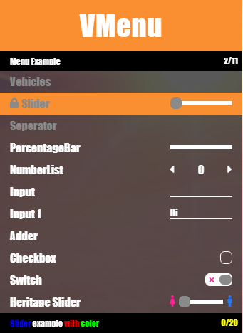
### Example 4
```js
// 1: Import the VMenu.
import * as VMenu from './js/VMenu.js';

// 2. Setup an VMenu.
const MainMenu = new VMenu.PlayerUI("VMenu", "Menu Example", "", "right", 50, 50, 340, "{#fa8f32}");

const list = new VMenu.PItemList("List", "List example", 0, "", "", [[10, 20, 30], ["Item 2 Large Text example", "item 2", "item 3"]]);
MainMenu.addItem(list);

MainMenu.addItem(new VMenu.PSeperator("Vehicles"));
MainMenu.addItem(new VMenu.PSlider("Slider", "~b~Slider ~w~example ~r~with ~g~color~y~", 0, "", "", 20, VMenu.DISABLED));
MainMenu.addItem(new VMenu.PSeperator("Seperator"));
MainMenu.addItem(new VMenu.PPercentageBar("PercentageBar", "Percent example", 0, "", "", 100));
MainMenu.addItem(new VMenu.PNumberList("NumberList", "NumberList example", 0, "", "", 9));
MainMenu.addItem(new VMenu.PInput("Input", "Input example", ""));
MainMenu.addItem(new VMenu.PInput("Input 1", "Input example with max", "Hi", "", "", 10));
MainMenu.addItem(new VMenu.PImageView("Adder", "Spawn Vehicle Adder", "", "", "", "./assets/adder.png"));
MainMenu.addItem(new VMenu.PCheckBox("Checkbox", "{#ff0000}Checkbox{#ffffff} example", false));
MainMenu.addItem(new VMenu.PSwitch("Switch", "Switch example"));
MainMenu.addItem(new VMenu.PColorPicker("ColorPicker", "ColorPicker example", new VMenu.Color(0, 255, 0)));
MainMenu.addItem(new VMenu.PHeritageSlider("Heritage Slider", "Heritage Slider example", 0, "", ""));

const sp = new VMenu.PStaticsPanel(["Top Speed", "Acceleration", "Braking", "Traction"], [60, 100, 30, -10], ["fas fa-tachometer-alt"], [], [100, 100, 100, 120]);
sp.appendTo(list, 0);

const instrutionalBar = new VMenu.InstrutionalBar();
instrutionalBar.addItem(new VMenu.IButton("Navigate", "fas fa-arrows-alt-v"));
instrutionalBar.addItem(new VMenu.IButton("Change Value", "fas fa-arrows-alt-h"));
instrutionalBar.appendTo(MainMenu);

// 3. Start the VMenu.
MainMenu.start();

// 4. Listen to the VMenu.
MainMenu.IndexChange.on((e) => {
    console.log(e);
});
MainMenu.ItemSelect.on((e) => {
    console.log(e);
});
```
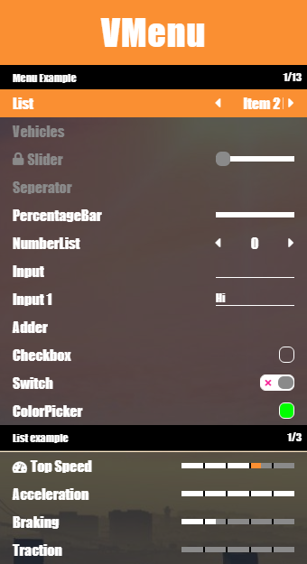
### Example 5
```js
// 1: Import the VMenu.
import * as VMenu from './js/VMenu.js';

// 2. Setup an VMenu.
const MainMenu = new VMenu.PlayerUI("VMenu", "Menu Example", "", "right", 50, 50, 340, "{#fa8f32}");

const list = new VMenu.PItemList("List", "List example", 0, "", "", [[10, 20, 30], ["Item 2 Large Text example", "item 2", "item 3"]]);
MainMenu.addItem(list);

MainMenu.addItem(new VMenu.PSeperator("Vehicles"));
MainMenu.addItem(new VMenu.PSlider("Slider", "~b~Slider ~w~example ~r~with ~g~color~y~", 0, "", "", 20, VMenu.DISABLED));
MainMenu.addItem(new VMenu.PSeperator("Seperator"));
MainMenu.addItem(new VMenu.PPercentageBar("PercentageBar", "Percent example", 0, "", "", 100));
MainMenu.addItem(new VMenu.PNumberList("NumberList", "NumberList example", 0, "", "", 9));
MainMenu.addItem(new VMenu.PInput("Input", "Input example", ""));
MainMenu.addItem(new VMenu.PInput("Input 1", "Input example with max", "Hi", "", "", 10));
MainMenu.addItem(new VMenu.PImageView("Adder", "Spawn Vehicle Adder", "", "", "", "./assets/adder.png"));
MainMenu.addItem(new VMenu.PCheckBox("Checkbox", "{#ff0000}Checkbox{#ffffff} example", false));
MainMenu.addItem(new VMenu.PSwitch("Switch", "Switch example"));
MainMenu.addItem(new VMenu.PColorPicker("ColorPicker", "ColorPicker example", new VMenu.Color(0, 255, 0)));
MainMenu.addItem(new VMenu.PHeritageSlider("Heritage Slider", "Heritage Slider example", 0, "", ""));

const sp = new VMenu.PStaticsPanel(["Top Speed", "Acceleration", "Braking", "Traction"], [60, 100, 30, -10], ["fas fa-tachometer-alt"], [], [100, 100, 100, 120]);
sp.appendTo(list, 0);

const instrutionalBar = new VMenu.InstrutionalBar();
instrutionalBar.addItem(new VMenu.IButton("Navigate", "fas fa-arrows-alt-v"));
instrutionalBar.addItem(new VMenu.IButton("Change Value", "fas fa-arrows-alt-h"));
instrutionalBar.appendTo(MainMenu);

const SubMenu = new VMenu.PSubMenu("Vehicles", "Vehicles Menu", "Vehicles", "Vehicles Menu");
SubMenu.addItem(new VMenu.PItem("Item SubMenu", "Sub Item example", ""));

const sub_list = new VMenu.PSlider("Slider SubMenu", "Sub Slider example", 0, "", "", 10);
SubMenu.addItem(sub_list);

SubMenu.addItem(new VMenu.PItemList("List SubMenu", "List example", 0, "", "", [["i1", "i2", "i3"], ["item 1", "item 2", "item 3"]]));
SubMenu.addItem(new VMenu.PSlider("Slider 1 SubMenu", "Slider example with start{#00ff00}", 3, "", "", 10));
SubMenu.addItem(new VMenu.PSlider("Slider 2 SubMenu", "~b~Slider ~w~example ~r~with ~g~color~y~", 0, "", "", 10));
SubMenu.addItem(new VMenu.PNumberList("NumberList SubMenu", "NumberList example", 0, "", "", 9));
SubMenu.addItem(new VMenu.PNumberList("NumberList 1 SubMenu", "NumberList example with start", 3, "", "", 9));
SubMenu.addItem(new VMenu.PImageView("Adder SubMenu", "Spawn Vehicle Adder", "", "", "", "./assets/adder.png"));
SubMenu.addItem(new VMenu.PImageView("Zorruso SubMenu", "Spawn Vehicle Zorruso", "", "", "", "./assets/zorrusso.png"));
SubMenu.addItem(new VMenu.PImageView("T20 SubMenu", "Spawn Vehicle T20", "", "", "", "./assets/t20.png"));
SubMenu.addItem(new VMenu.PInput("Input SubMenu", "Input example", ""));
SubMenu.addItem(new VMenu.PInput("Input 2 SubMenu", "Input example with max", "Hi", "", "", 10));
SubMenu.addItem(new VMenu.PInput("Input 3 SubMenu", "Input example with pattern", "", "", "", 10, "{0-9}"));
SubMenu.addItem(new VMenu.PColorPicker("ColorPicker SubMenu", "ColorPicker example", new VMenu.Color(0, 255, 0)));

const ItemSubinstrutionalBar = new VMenu.InstrutionalBar();
ItemSubinstrutionalBar.addItem(new VMenu.IButton("Test item"));
ItemSubinstrutionalBar.appendTo(sub_list);

// 3. Start the VMenu.
MainMenu.addItem(SubMenu);
MainMenu.start();

// 4. Listen to the VMenu.
MainMenu.IndexChange.on((e) => {
    console.log(e);
});
MainMenu.ItemSelect.on((e) => {
    console.log(e);
});
```
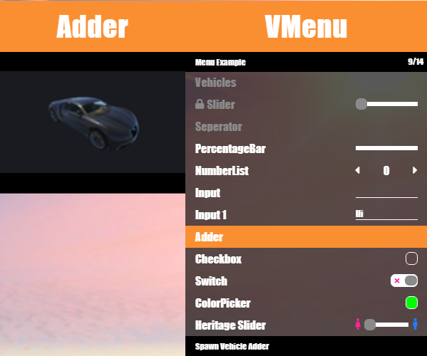
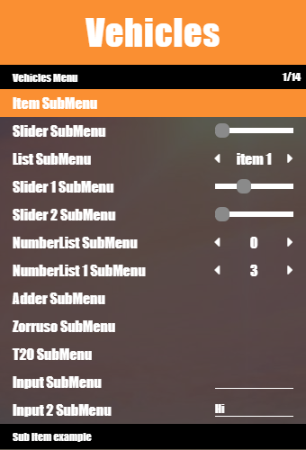
&nbsp;
&nbsp;
## How to use SettingsUI
### Example 1
```js
// 1: Import the VMenu.
import * as VMenu from './js/VMenu.js';

// 2. Setup an VMenu.
const MainMenu = new VMenu.SettingsUI("Settings UI", "", "{#fa8f32}");

// 3. Setup an VMenu Tab.
const tab_1 = new VMenu.STab("Tab 1");

// 4. Setup an VMenu TabData.
const tab_1_data = new VMenu.STabData("Example Data");
tab_1_data.addItem(new VMenu.SItem("Item <i class='fas fa-shield-alt'></i>", "Item example", ""));
tab_1_data.addItem(new VMenu.SItemList("Item List", "Item List example", 0, "", "", [["i 1", "i 2", "i 3", "i 4"], [1, 2, 3, 4]]));
tab_1_data.addItem(new VMenu.SSeperator("Seperator"));
tab_1_data.addItem(new VMenu.SNumberList("Number List", "Number List example", 0, "", "", 10));
tab_1_data.addItem(new VMenu.SSlider("Slider", "Slider example", 4, "", "", 20));
tab_1.addItem(tab_1_data);

// 5. Add Tab to VMenu.
MainMenu.addItem(tab_1);

// 6. Start the VMenu.
MainMenu.start();

// 7. Listen to the VMenu.
MainMenu.ItemSelect.on((e) => {
    console.log(e);
});
```
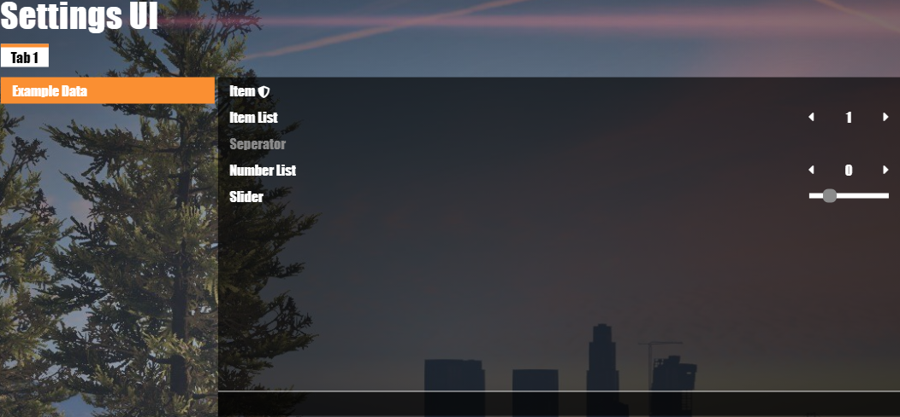
### Example 2
```js
// 1: Import the VMenu.
import * as VMenu from './js/VMenu.js';

// 2. Setup an VMenu.
const MainMenu = new VMenu.SettingsUI("Settings UI", "", "{#fa8f32}");

// 3. Setup an VMenu Tab.
const tab_1 = new VMenu.STab("Tab 1");

// 4. Setup an VMenu TabData.
const tab_1_data = new VMenu.STabData("Example Data");
tab_1_data.addItem(new VMenu.SItem("Item <i class='fas fa-shield-alt'></i>", "Item example", ""));
tab_1_data.addItem(new VMenu.SItemList("Item List", "Item List example", 0, "", "", [["i 1", "i 2", "i 3", "i 4"], [1, 2, 3, 4]]));
tab_1_data.addItem(new VMenu.SSeperator("Seperator"));
tab_1_data.addItem(new VMenu.SNumberList("Number List", "Number List example", 0, "", "", 10));
tab_1_data.addItem(new VMenu.SSlider("Slider", "Slider example", 4, "", "", 20));
tab_1_data.addItem(new VMenu.SPercentageBar("PercentageBar", "PercentageBar example", 60, "", "", 60));
tab_1_data.addItem(new VMenu.SCheckBox("CheckBox", "CheckBox example", true));
tab_1_data.addItem(new VMenu.SSwitch("Switch", "Switch example"));
tab_1.addItem(tab_1_data);

const tab_1_data_2 = new VMenu.STabData("Example Data 2");
tab_1_data_2.addItem(new VMenu.SItem("Item 2", "Item 2 example", ""));
tab_1_data_2.addItem(new VMenu.SItemList("Item List 2", "Item List 2 example", 2, "", "", [["i 1", "i 2", "i 3", "i 4"], [1, 2, 3, 4]]));
tab_1_data_2.addItem(new VMenu.SItemList("Item List 3", "Item List 3 example", "Non-Stop-Pop FM", "", "", ["Radio Los Santos", "Space 103.2", "West Coast Classics", "Rebel Radio", "Los Santos Rock Radio", "Non-Stop-Pop FM"]));
tab_1_data_2.addItem(new VMenu.SSeperator("Seperator 2"));
tab_1_data_2.addItem(new VMenu.SNumberList("Number List 2", "Number List 2 example", 10, "", "", 10));
tab_1_data_2.addItem(new VMenu.SSlider("Slider 2", "Slider 2 example", 4, "", "", 4));
tab_1.addItem(tab_1_data_2);

// 5. Add Tab to VMenu.
MainMenu.addItem(tab_1);

// 6. Start the VMenu.
MainMenu.start();

// 7. Listen to the VMenu.
MainMenu.ItemSelect.on((e) => {
    console.log(e);
});
```
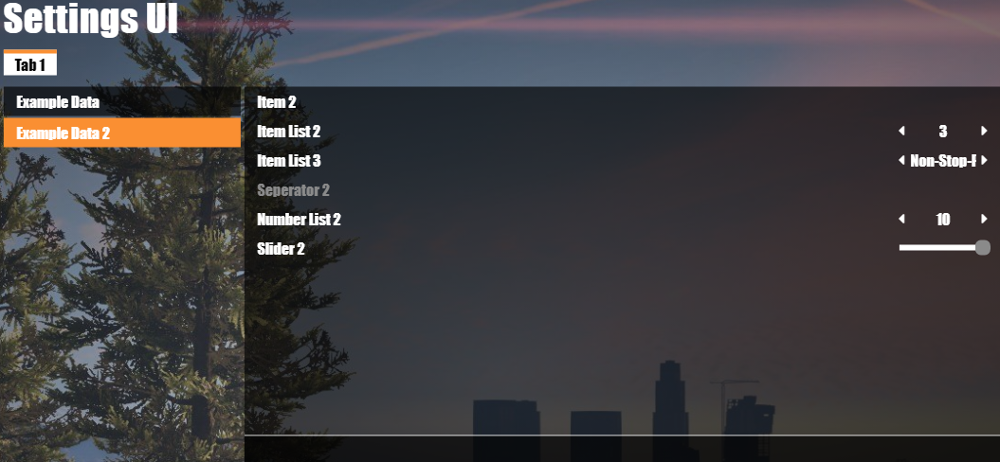
### Example 3
```js
// 1: Import the VMenu.
import * as VMenu from './js/VMenu.js';

// 2. Setup an VMenu.
const MainMenu = new VMenu.SettingsUI("Settings UI", "", "{#fa8f32}");

// 3. Setup an VMenu Tab.
const tab_1 = new VMenu.STab("Tab 1");

// 4. Setup an VMenu TabData.
const tab_1_data = new VMenu.STabData("Example Data");
tab_1_data.addItem(new VMenu.SItem("Item <i class='fas fa-shield-alt'></i>", "Item example", ""));
tab_1_data.addItem(new VMenu.SItemList("Item List", "Item List example", 0, "", "", [["i 1", "i 2", "i 3", "i 4"], [1, 2, 3, 4]]));
tab_1_data.addItem(new VMenu.SSeperator("Seperator"));
tab_1_data.addItem(new VMenu.SNumberList("Number List", "Number List example", 0, "", "", 10));
tab_1_data.addItem(new VMenu.SSlider("Slider", "Slider example", 4, "", "", 20));
tab_1_data.addItem(new VMenu.SPercentageBar("PercentageBar", "PercentageBar example", 60, "", "", 60));
tab_1_data.addItem(new VMenu.SCheckBox("CheckBox", "CheckBox example", true));
tab_1_data.addItem(new VMenu.SSwitch("Switch", "Switch example"));
tab_1.addItem(tab_1_data);

const tab_1_data_2 = new VMenu.STabData("Example Data 2");
tab_1_data_2.addItem(new VMenu.SItem("Item 2", "Item 2 example", ""));
tab_1_data_2.addItem(new VMenu.SItemList("Item List 2", "Item List 2 example", 2, "", "", [["i 1", "i 2", "i 3", "i 4"], [1, 2, 3, 4]]));
tab_1_data_2.addItem(new VMenu.SItemList("Item List 3", "Item List 3 example", "Non-Stop-Pop FM", "", "", ["Radio Los Santos", "Space 103.2", "West Coast Classics", "Rebel Radio", "Los Santos Rock Radio", "Non-Stop-Pop FM"]));
tab_1_data_2.addItem(new VMenu.SSeperator("Seperator 2"));
tab_1_data_2.addItem(new VMenu.SNumberList("Number List 2", "Number List 2 example", 10, "", "", 10));
tab_1_data_2.addItem(new VMenu.SSlider("Slider 2", "Slider 2 example", 4, "", "", 4));
tab_1.addItem(tab_1_data_2);

const tab_2 = new VMenu.STab("Tab 2");
const tab_2_data = new VMenu.STabData("Example Data 2");
tab_2_data.addItem(new VMenu.SItem("Item 2", "Item 2 example", ""));
tab_2_data.addItem(new VMenu.SItemList("Item List 2", "Item List 2 example", 2, "", "", [["i 1", "i 2", "i 3", "i 4"], [1, 2, 3, 4]]));
tab_2_data.addItem(new VMenu.SSeperator("Seperator 2"));
tab_2_data.addItem(new VMenu.SSlider("Slider 2", "Slider 2 example", 0, "", "", 100));
tab_2_data.addItem(new VMenu.SNumberList("Number List 2", "Number List 2 example", 0, "", "", 10));
tab_2.addItem(tab_2_data);

// 5. Add Tab to VMenu.
MainMenu.addItem(tab_1);
MainMenu.addItem(tab_2);

// 6. Start the VMenu.
MainMenu.start();

// 7. Listen to the VMenu.
MainMenu.ItemSelect.on((e) => {
    console.log(e);
});
```
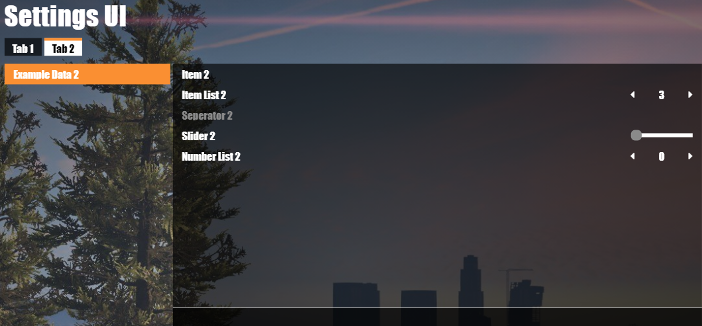
&nbsp;
&nbsp;
## How to use GameUI
### Example 1
```js
// 1: Import the VMenu.
import * as VMenu from './js/VMenu.js';

// 2. Setup an VMenu.
const MainMenu = new VMenu.GameUI("LS Airport Bike Race", "This Race is an Hard onwe ;)");

// 3. Setup an VMenu Settings Tab.
const MainSettings = new VMenu.GSettings();
MainSettings.addItem(new VMenu.GItem("Armor <i class='fas fa-shield-alt'></i>", "Give Start Armor", 100, "", "", new VMenu.Badge("100%")));
MainSettings.addItem(new VMenu.GSeperator("Seperator"));
MainSettings.addItem(new VMenu.GItemList("Start Weapon", "Give Start Weapon", "Dagger", "", "", ["Dagger", "Pistol", "Knife", "Bat"]));
MainSettings.addItem(new VMenu.GNumberList("Cash", "Give Start Cash", 100, "", "", 100));
MainSettings.addItem(new VMenu.GSlider("{#fa8f32}Slider", "Slider Example", 2, "", "", 10));
MainSettings.addItem(new VMenu.GSlider("Slider", "Slider Example", 2, "", "", 10, VMenu.DISABLED));
MainSettings.addItem(new VMenu.GPercentageBar("Percent Bar", "Percent Bar Example", 25, "", "", 100, VMenu.ONLY_VALUE));
MainSettings.addItem(new VMenu.GCheckBox("Check Box", "Check Box Example", false));
MainSettings.addItem(new VMenu.GSwitch("Switch", "Switch Example", false, "", "", VMenu.AUTO_SELECT));

// 4. Setup an VMenu Player Tab.
const MainPlayers = new VMenu.GPlayers(1, 6);
MainPlayers.addItem(new VMenu.GPlayer("Flory", VMenu.STATUS_HOST));
MainPlayers.addItem(new VMenu.GPlayer("Jack", VMenu.STATUS_READY));
MainPlayers.addItem(new VMenu.GPlayer("Nik", VMenu.STATUS_LEAVE));
MainPlayers.addItem(new VMenu.GPlayer("Alex", VMenu.STATUS_ENTER));

// 5. Setup an VMenu Details Tab.
const MainDetails = new VMenu.GDetails("./css/test_2.jpg");
MainDetails.addItem(new VMenu.GDetail("Rating", "3/5", "fas fa-star"));
MainDetails.addItem(new VMenu.GDetail("Schwirigkeit", "20%"));

// 6. Add Tab to VMenu.
MainMenu.addItem(MainSettings);
MainMenu.addItem(MainPlayers);
MainMenu.addItem(MainDetails);

// 7. Start the VMenu.
MainMenu.start();
MainMenu.open();

// 8. Listen to the VMenu.
MainMenu.ItemSelect.on((e) => {
    console.log(e);
});
```
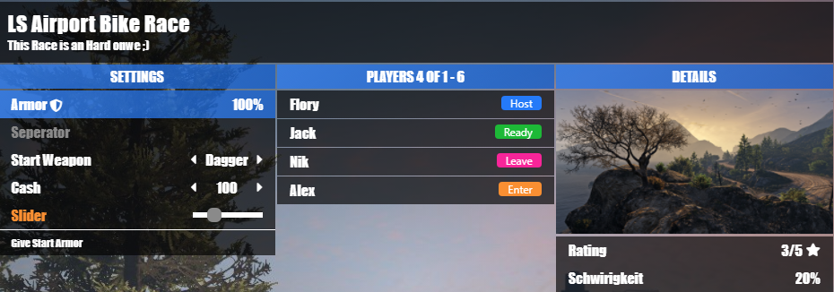
### Example 2
```js
// 1: Import the VMenu.
import * as VMenu from './js/VMenu.js';

// 2. Setup an VMenu.
const MainMenu = new VMenu.GameUI("LS Airport Bike Race", "This Race is an Hard onwe ;)");

// 3. Setup an VMenu Settings Tab.
const MainSettings = new VMenu.GSettings();
MainSettings.addItem(new VMenu.GItem("Armor <i class='fas fa-shield-alt'></i>", "Give Start Armor", 100, "", "", new VMenu.Badge("100%")));
MainSettings.addItem(new VMenu.GSeperator("Seperator"));
MainSettings.addItem(new VMenu.GItemList("Start Weapon", "Give Start Weapon", "Dagger", "", "", ["Dagger", "Pistol", "Knife", "Bat"]));
MainSettings.addItem(new VMenu.GNumberList("Cash", "Give Start Cash", 100, "", "", 100));
MainSettings.addItem(new VMenu.GSlider("{#fa8f32}Slider", "Slider Example", 2, "", "", 10));
MainSettings.addItem(new VMenu.GSlider("Slider", "Slider Example", 2, "", "", 10, VMenu.DISABLED));
MainSettings.addItem(new VMenu.GPercentageBar("Percent Bar", "Percent Bar Example", 25, "", "", 100, VMenu.ONLY_VALUE));
MainSettings.addItem(new VMenu.GCheckBox("Check Box", "Check Box Example", false));
MainSettings.addItem(new VMenu.GSwitch("Switch", "Switch Example", false, "", "", VMenu.AUTO_SELECT));

// 4. Setup an VMenu Player Tab.
const MainPlayers = new VMenu.GPlayers(1, 6);
let player_1 = new VMenu.GPlayer("Flory", VMenu.STATUS_HOST);
MainPlayers.addItem(player_1);
let player_2 = new VMenu.GPlayer("Jack", VMenu.STATUS_READY);
MainPlayers.addItem(player_2);
let player_3 = new VMenu.GPlayer("Nik", VMenu.STATUS_LEAVE);
MainPlayers.addItem(player_3);
let player_4 = new VMenu.GPlayer("Alex", VMenu.STATUS_ENTER);
MainPlayers.addItem(player_4);

// 5. Setup an VMenu Details Tab.
const MainDetails = new VMenu.GDetails("./css/test_2.jpg");
MainDetails.addItem(new VMenu.GDetail("Rating", "3/5", "fas fa-star"));
MainDetails.addItem(new VMenu.GDetail("Schwirigkeit", "20%"));

// 6. Add Tab to VMenu.
MainMenu.addItem(MainSettings);
MainMenu.addItem(MainPlayers);
MainMenu.addItem(MainDetails);

// 7. Start the VMenu.
MainMenu.start();
MainMenu.open();

// 8. Listen to the VMenu.
MainMenu.ItemSelect.on((e) => {
    console.log(e);
});

// 9. Trigger Events on Player Tab.
setTimeout(() => {
    player_4.update(VMenu.STATUS_READY);

    let player_5 = new VMenu.GPlayer("Simon", VMenu.STATUS_ENTER);
    MainPlayers.addItem(player_5);
    MainPlayers.removeItem(player_3);
}, 4500);
```
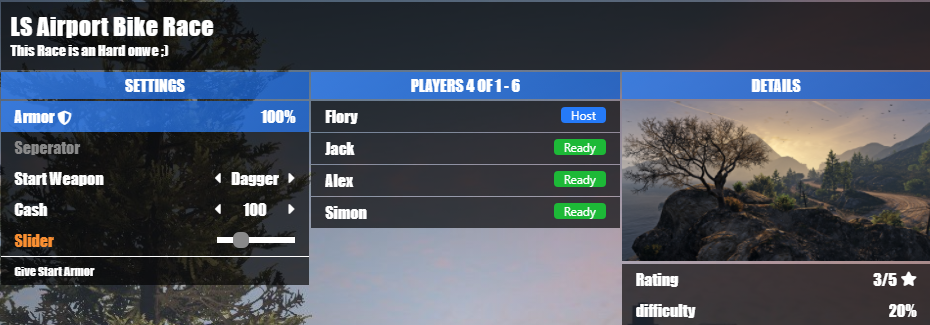
&nbsp;
&nbsp;
***
## Legacy versions
This version of the VMenu are the acctual stable version which is supported for feature updates.

## Do you have any Ideas, Changes or Bugs ?
Please let me know in the Comments, i will try to fix or add waht you found/want :D